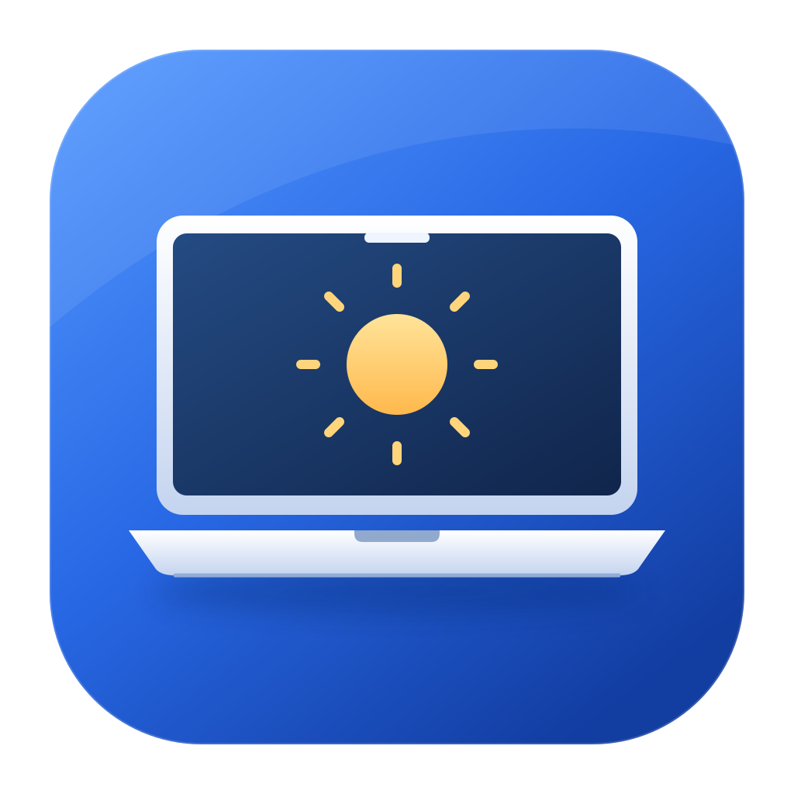

<h1 align="center">LidKeep</h1>

Close your MacBook. Keep your work running.

<a href="../../releases">Download</a> · <a href="docs/USAGE.md">User guide</a> · <a href="README.zh-CN.md">简体中文</a>

LidKeep is a lightweight, native macOS utility that keeps downloads, builds and long-running tasks moving when your MacBook is closed or locked. No external display required.

## Features

- 💻 **Keep working** — Keep your MacBook awake with the lid closed or the screen locked.
- ⚡ **Power-aware policies** — Configure sleep behavior and lock delays separately for AC and battery power.
- 🖥️ **Display-aware behavior** — Sleep or stay awake when an external display disconnects, based on the power source.
- 🔄 **Restore and remove** — Restore original power settings and completely remove the helper and background service.
- 🌐 **Native, bilingual experience** — Menu bar access and instant English/Chinese switching. No accounts or telemetry.

## Download and install

Download the **DMG or App ZIP** from [Releases](../../releases). Open the DMG (or extract the ZIP), drag `LidKeep.app` into **Applications**, and launch it from there.

**First launch:** Current `local` releases are not Apple-notarized. If macOS blocks LidKeep, click **Done**, then go to **System Settings → Privacy & Security → Security**, click **Open Anyway** for LidKeep, authenticate, and confirm **Open**. Only allow a download you trust. [Apple's instructions](https://support.apple.com/102445)

Requires **macOS 14 or later**. One universal app for **Apple Silicon and Intel**. [Compatibility details](docs/COMPATIBILITY.md)

---

[Report an issue](../../issues) · [Contribute](CONTRIBUTING.md) · [MIT license](LICENSE)
